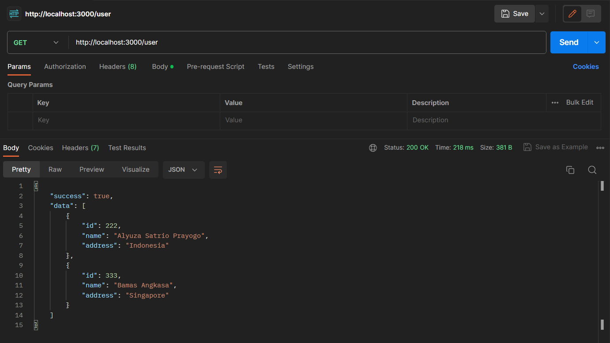
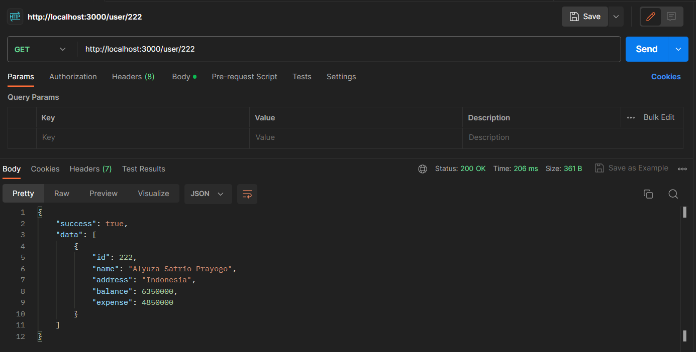
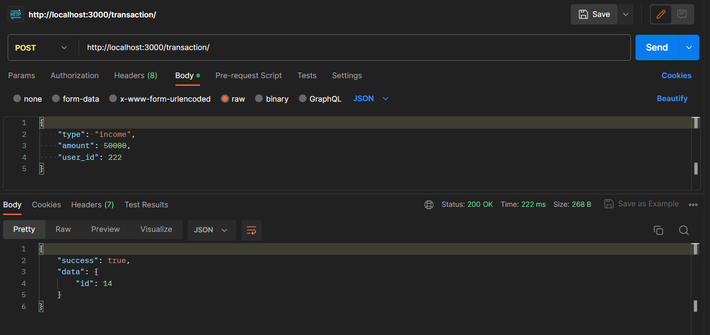
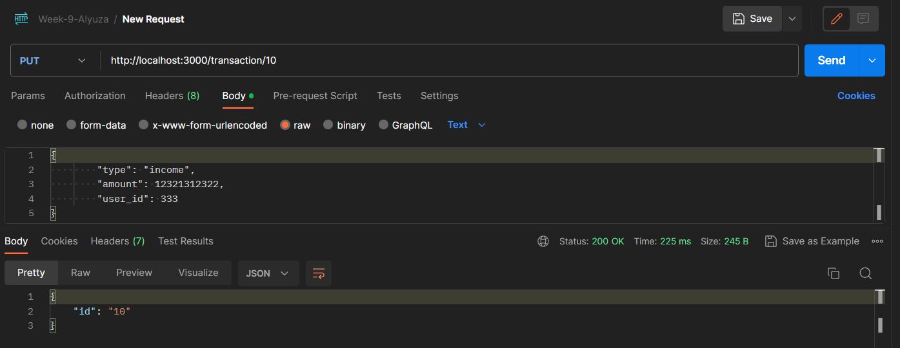
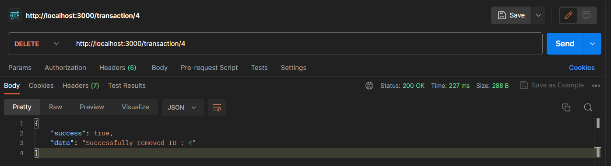
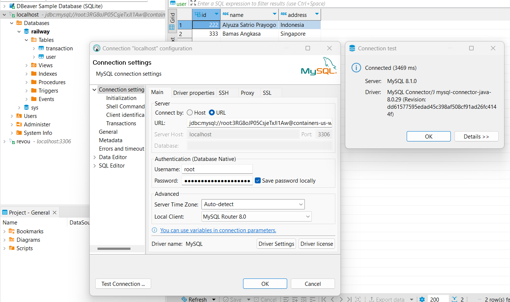
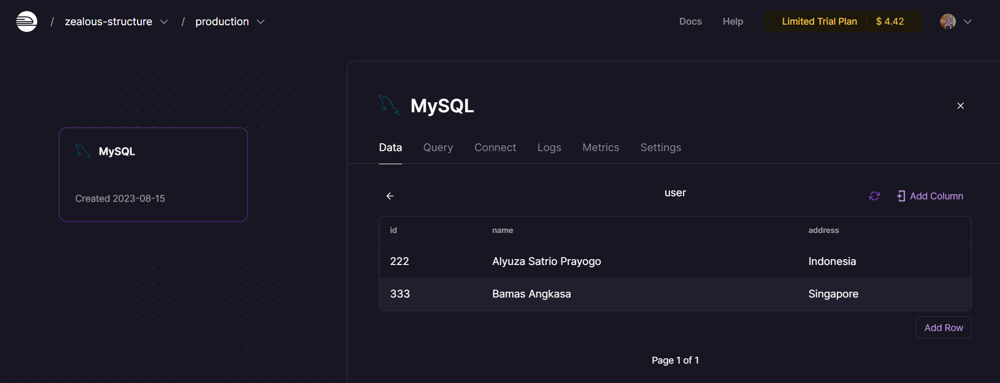

<!--  -->

# Week 9 Assignment

## TOOLS & INGREDIENTS

- Node.js & Express.js
- MySQL
- DBeaver
- Postman

## FEATURES

- Get all user data
- Get user's balance by ID
- Create / Post a transaction
- Update / Put a transaction
- Delete a transaction

## API ENDPOINTS

| Name  | HTTP Method | Endpoint | 
| ----- | ----------- | ---------|
| **Get All User Data** | `GET` | `/user`|
| **Get User's Total Balance** | `GET` | `/user/:id` |
| **Create a New Transaction** | `POST` | `/transaction` |
| **Update Transaction Data by ID** | `PUT` | `/transaction/:id` |
| **Delete Transaction Data by ID** | `DELETE` | `/transaction/:id` |

## CONTRACTS

**GET**/user

**GET**/user/:id

**POST**/transaction

**PUT**/transaction/:id

**DELETE**/transaction/:id

**MYSQL Connection** connect to Railway

 Railway" width="550px">

**Railway**

## DEPLOYMENT

Deployment link here

## CONTACT ME
  